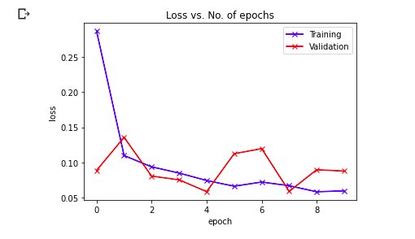
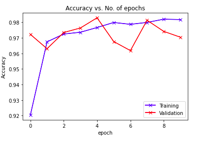
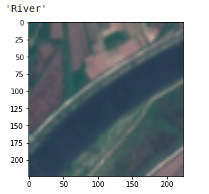
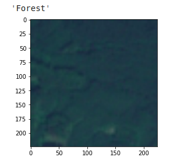
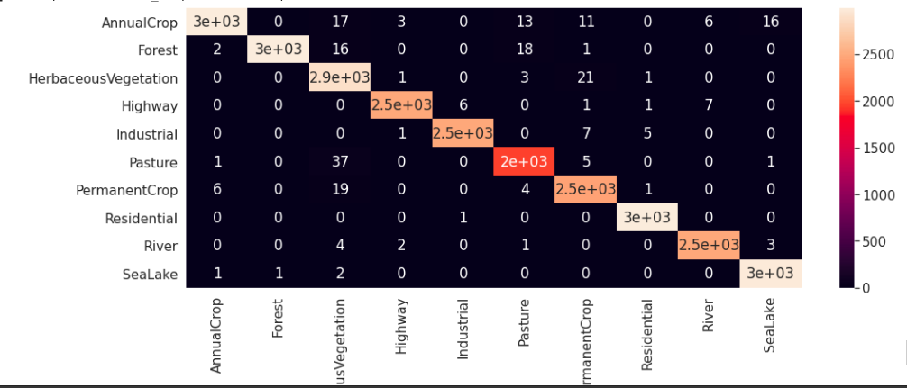
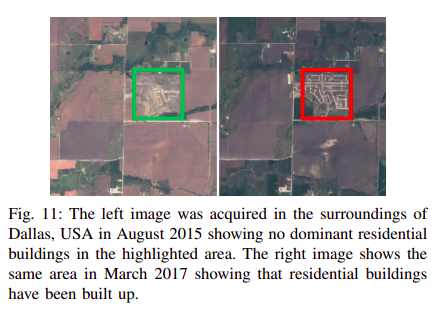
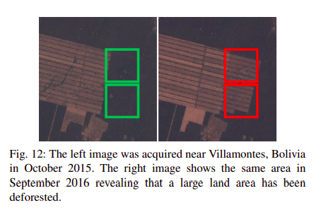
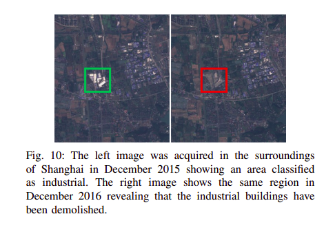

# Land Cover and Land Use Classification using Sentinel-2 Satellite Imagery With Deep Learning
----------------------------------------------------------------------
__This work has been published on <> [Sensors - MDPI](https://www.mdpi.com/1424-8220/21/23/8083)__

__For better understanding whole idea <> [Check out this blog](https://raoofnaushad7.medium.com/applying-deep-learning-on-satellite-imagery-951faa0cbb31)__

For implementation:

* Run the notebook to generate the model.
* Dataset can be downloaded from the link [here](https://github.com/phelber/eurosat). 
* Save model in the Models directory
* Install required packages
* Run app.py (send an image file as a request to the classify end poing and will get the class for it).

### Scenario
Many government programs are taking enormous efforts to make satellite images free and open sourced inorder to bring in innovation and entrepreunership. This is being used by many domains and are coming up with good results. Inorder to get great insights and knowledge from this satellite data we have to segment and understand it for further studies. Such type of a task is Landcover classification which come up and automate the process of identifying how the land area is used. We have seen a great spike in the growth of Machine learning and Artificial intelligence. Almost all domain in the world is using Deep learning techniques to improve the performance and are benefiting from this. So here we try to use deep learning methods to work with land cover classification.

### Overview

 
[Source](https://arxiv.org/pdf/1709.00029.pdf)

A satellite scans the Earth to acquire images of it. Patches extracted out of these images are used for classification.
The aim is to automatically provide labels describing the represented physical land type or how the land is used. For this
purpose, an image patch is feed into a classifier, in this illustration a neural network, and the classifier outputs the class shown
on the image patch.

This satellite conver 13 spectral bands, where the  three bands B01, B09 and B10 are intended to be used for the correction of atmospheric effects (e.g., aerosols, cirrus or water vapor). The remaining bands are
primarily intended to identify and monitor land use and land cover classes. Each satellite will deliver imagery for at least 7 years with a spatial resolution of up to 10 meters per pixel.

In order to improve the chance of getting valuable image patches, they have selected satellite images with a low cloud level. Besides the possibility to generate a cloud mask, ESA provides a cloud level value for each satellite image allowing to quickly select images with a low percentage of clouds covering the land scene.

### Results

Below shows the graph of __accuracy__ and __losses__ against __epochs__ for both training and testing data.

Some __prediction results__ are shown below

__Confusion Matrix__ 

### Dataset
1. EuroSAT dataset is open sourced.
2. It consist of satellite images RGB and multi spectral - covering 13 spectral bands (including visible, newar infrared, shortwave infrared) with 10 unique classes.
3. It consist of 27000 labeled and geo-referenced images.
4. The dataset is published and benchmarked with CNN by a paper titled EuroSAT: A Novel Dataset and Deep Learning Benchmark for Land Use and Land Cover Classification and they have made dataset public through this repo.

The authors were able to sort out some common issues that come up with studying satellite data and were able to sort it out for land use and land cover classification.

* Cloud appearence
* Color casting due to atmospheric effects
* Dead/pixels
* Ice or snow

##### Band Evaluation
In order to evaluate the performance of deep CNNs in a multi spectral dataset using single-band images as well shortwave-infrared and color infrared band combinations, we used the pretrained wide ResNet-50 with a fixed training-test split to compare the performance of the different spectral bands. For evaluating single-band image they inserted the information from a single spectral band on all three input channels. Bands with a lower spatial resolution have been up sampled to 10 meters per pixel using cubic-spline interpolation.

### Working

Here we use deep learning along with transfer learning to improve the accuracy and also make the training faster. We will work on __Pytorch__ as the framework for our deep learning model.

We can get the dataset from [here](https://github.com/phelber/eurosat). Dataset is provided in both `.tiff` format and also `image` format. `.tiff` format can be used to extract other spectral information since they provided multi spectral data with 13 different spectrum, We use RGB because pretrained models are already trained in RGB images so we can take the image dataset and work on it.

We have to create the dataset class, transformations and dataloaders. We create a EuroSAT dataset class inherited from torch dataset library. Creating our own method to get data which takes the name of the file and taking it from each directory. We also add transforms as some data augmentation and preprocessing stepfor using it with the pretrained model. Then we create dataset and data loader for training and validation with the preferred batch_size, feel free to experiment with more transformation which might help you to improve accuracy.

For creating the model. We use transfer learning, here we use __wide_resnet50_2__ model as a pretrained model which is already trained on a huge image dataset. We change the classification layer of wide_resnet50_2 with some additional sequential layers for fine tuning. This added layer includes Linear layer(n_inputs, 256) => ReLU layer => Dropout Layer => Linear Layer (256, num_classes) => LogSoftmax layer In the model class we also include freeze and unfreeze function in order to select training the whole architecture or only the classification layer we added.

We trained the model for 10 epochs and save the best model based on the accuracy and losses.

### Applications
Since the Sentinel-2 satellite constellation will scan the Earth's land surface for about the next 20–30 years on a repeat cycle of about five days, a trained classifier can be used for monitoring land surfaces and detect changes in land use or land cover. These land cover changes can be used for various studies and purposes. In future may be we can add a real time open sourced web network for everyone in the world to see how the world around them changes in years. Some changes that are understood in various years on the same place is shown below. This is also part of the paper.

  
[Source](https://arxiv.org/pdf/1709.00029.pdf)

 
[Source](https://arxiv.org/pdf/1709.00029.pdf)

 
[Source](https://arxiv.org/pdf/1709.00029.pdf)

### Challenges

There are lots of challenges while evaluating raw images from satellite for prediction which includes Cloud appearence, Color casting due to atmospheric effects, Dead/pixels, Ice or snow. More than that a classification system trained with 64x64 image patches does not allow a finely graduated per-pixel segmentation. Also when there is mixed elemets in the same image patches that can also lead to trouble.

### Reference

[EuroSAT: A Novel Dataset and Deep Learning
Benchmark for Land Use and Land Cover
Classification](https://arxiv.org/abs/1709.00029)

@inproceedings{helber2018introducing,
  title={Introducing EuroSAT: A Novel Dataset and Deep Learning Benchmark for Land Use and Land Cover Classification},
  author={Helber, Patrick and Bischke, Benjamin and Dengel, Andreas and Borth, Damian},
  booktitle={IGARSS 2018-2018 IEEE International Geoscience and Remote Sensing Symposium},
  pages={204--207},
  year={2018},
  organization={IEEE}
}
